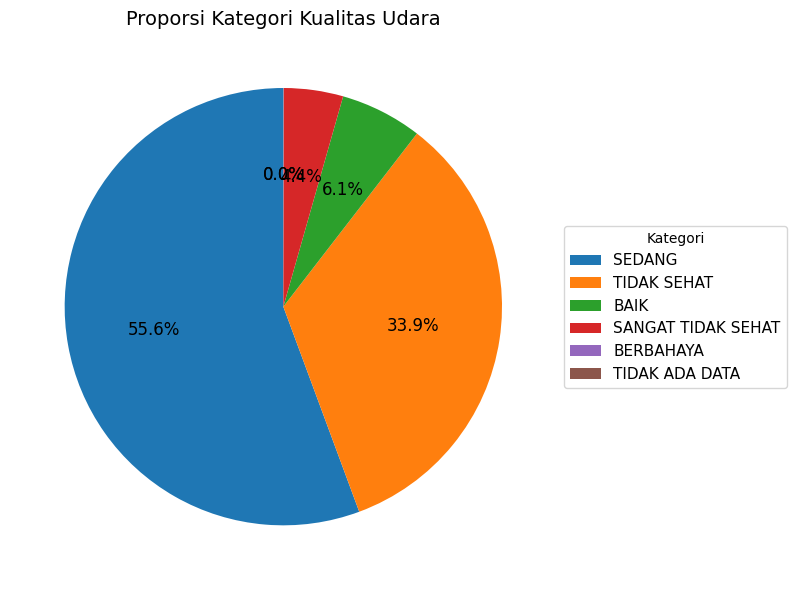

# Laporan Proyek Machine Learning - Ryan Nugroho

## Domain Proyek

Kualitas udara merupakan faktor krusial yang berdampak langsung pada kesehatan manusia dan keberlanjutan lingkungan. Di kota metropolitan seperti Jakarta, polusi udara menjadi ancaman nyata yang semakin memburuk akibat pertumbuhan kendaraan bermotor, industrialisasi, dan urbanisasi yang pesat.

Menurut laporan dari [World Health Organization (WHO)](https://www.who.int/news-room/fact-sheets/detail/ambient-(outdoor)-air-quality-and-health), **paparan polusi udara menyebabkan sekitar 7 juta kematian prematur setiap tahunnya**. Polutan seperti **PM₁₀**, **SO₂**, **CO**, **O₃**, dan **NO₂** berkontribusi besar terhadap penyakit pernapasan, kardiovaskular, dan penurunan kualitas hidup secara umum.

Di Indonesia, khususnya Jakarta, tingkat polusi udara kerap berada dalam kategori **tidak sehat**, sebagaimana dilaporkan oleh [IQAir Indonesia](https://www.iqair.com/indonesia). Data dari stasiun pemantauan menunjukkan fluktuasi signifikan pada konsentrasi polutan setiap hari, bulan, bahkan musim. Sayangnya, informasi ini bersifat retrospektif dan kurang memberikan gambaran mengenai **kondisi udara di masa depan**.

---

### Permasalahan dan Urgensi

Tanpa adanya sistem peringatan dini atau proyeksi kondisi udara ke depan, masyarakat dan pemerintah kehilangan kesempatan untuk:
- Mengambil tindakan preventif untuk melindungi kelompok rentan (anak-anak, lansia, penderita penyakit paru).
- Menetapkan kebijakan berbasis data seperti pembatasan kendaraan atau penutupan sementara aktivitas industri.
- Mengoptimalkan upaya mitigasi perubahan iklim dan pencemaran.

Oleh karena itu, dibutuhkan solusi berbasis data dan kecerdasan buatan yang mampu **memprediksi kualitas udara secara akurat** untuk waktu mendatang.

---

### Solusi yang Diajukan

Proyek ini bertujuan untuk membangun model **machine learning untuk forecasting kualitas udara di Jakarta**, berdasarkan data historis dari berbagai stasiun pemantauan. Model ini dirancang untuk:
- Memprediksi kondisi udara **keesokan hari** (short-term).
- Melakukan proyeksi **hingga 1 bulan** dan **1 tahun ke depan** (mid- dan long-term forecast).

Dengan pendekatan ini, diharapkan sistem prediksi ini dapat:
- Mendukung pengambilan keputusan berbasis data oleh pemangku kebijakan.
- Membantu peneliti dan lembaga lingkungan dalam pemantauan tren polusi.
- Memberikan informasi proaktif kepada masyarakat umum.

---

> Referensi:
> - World Health Organization. (2023). *Ambient (outdoor) air quality and health*. [Link](https://www.who.int/news-room/fact-sheets/detail/ambient-(outdoor)-air-quality-and-health)
> - IQAir Indonesia. (2023). *Jakarta Air Quality Index (AQI)*. [Link](https://www.iqair.com/indonesia)

## Business Understanding

### Problem Statements

1. **Kualitas udara di Jakarta mengalami fluktuasi yang signifikan setiap harinya,** namun belum tersedia sistem prediksi yang mampu memberikan estimasi kondisi udara di masa mendatang secara akurat.
2. **Kurangnya sistem peringatan dini dan proyeksi jangka panjang** menyebabkan keterlambatan dalam penanganan dampak polusi, terutama bagi kelompok rentan dan sektor transportasi.
3. **Belum ada model prediktif berbasis data historis yang secara efektif digunakan untuk forecasting kualitas udara di Jakarta**, baik untuk kebutuhan pemerintah, lembaga lingkungan, maupun masyarakat umum.

---

### Goals

- Membangun model machine learning yang mampu **memprediksi konsentrasi lima polutan utama**: PM₁₀, SO₂, CO, O₃, dan NO₂ berdasarkan data historis harian dari berbagai stasiun di Jakarta.
- Menghasilkan prediksi kualitas udara untuk tiga skenario waktu:
  - Prediksi **besok (next-day forecast)**
  - Prediksi **1 bulan ke depan (short-term forecast)**
  - Prediksi **1 tahun ke depan (long-term forecast)**
- Menyediakan hasil evaluasi model menggunakan metrik regresi seperti:
  - **MAE (Mean Absolute Error)**
  - **MSE (Mean Squared Error)**
  - **RMSE (Root Mean Squared Error)**
  - **R² (R-squared Score)**

---

### Solution Statements

Untuk mencapai tujuan di atas, solusi yang dirancang adalah sebagai berikut:

#### Solusi 1: Random Forest Regressor sebagai Baseline
- Model ensambel yang kuat dalam menangani data non-linear dan fitur yang saling berinteraksi.
- Digunakan sebagai baseline karena kemudahannya dalam interpretasi dan performa awal yang stabil.
- Evaluasi dilakukan berdasarkan performa pada data validasi dan metrik R².

#### Solusi 2: Support Vector Regression (SVR)
- Digunakan sebagai alternatif dengan harapan mampu meningkatkan akurasi prediksi.
- SVR dikombinasikan dengan `MultiOutputRegressor` untuk menangani prediksi multi-target.
- Data dilakukan **standardisasi** sebelum modeling karena SVR sensitif terhadap skala fitur.
- Evaluasi dilakukan menggunakan metrik yang sama dengan baseline.

#### Perbandingan Model:
- Kedua model dibandingkan berdasarkan nilai **R²**, **RMSE**, dan **MAE** untuk menentukan model terbaik.
- Hasil evaluasi menunjukkan **SVR memiliki performa yang lebih baik dan konsisten** pada seluruh target variabel.

---

> Dengan merancang dua solusi berbeda dan melakukan evaluasi metrik secara menyeluruh, proses pemilihan model terbaik menjadi lebih objektif dan transparan.

## Data Understanding
Dataset yang digunakan dalam proyek ini adalah **Air Quality Index in Jakarta**, yang tersedia secara publik di Kaggle. Dataset ini berisi data kualitas udara di beberapa stasiun pemantauan di Jakarta dari tahun 2010 hingga 2021.

🔗 **Sumber Data**: [Air Quality Index in Jakarta (Kaggle)](https://www.kaggle.com/datasets/senadu34/air-quality-index-in-jakarta-2010-2021)

---

### Informasi Umum Dataset
- **Jumlah baris**: 4627 observasi
- **Periode data**: 2010 hingga 2021
- **Kondisi data**:
  - Terdapat missing values pada beberapa fitur numerik.
  - Beberapa outlier ditemukan pada fitur polutan.
  - Data disusun secara harian dari beberapa stasiun pemantauan udara di Jakarta.

---

### Deskripsi Variabel

| **Nama Kolom** | **Deskripsi** |
|----------------|---------------|
| `tanggal` | Tanggal pencatatan data kualitas udara (format: `YYYY-MM-DD`). |
| `stasiun` | Lokasi atau kode stasiun pemantauan, misalnya `DKI1 (Bunderan HI)`. |
| `pm10` | Konsentrasi partikel udara berukuran ≤10 mikrometer (µg/m³). |
| `pm25` | Konsentrasi partikel udara berukuran ≤2.5 mikrometer (µg/m³). |
| `so2` | Konsentrasi gas **Sulfur Dioksida (SO₂)** (µg/m³). |
| `co` | Konsentrasi **Karbon Monoksida (CO)** (µg/m³). |
| `o3` | Konsentrasi **Ozon (O₃)** permukaan (µg/m³). |
| `no2` | Konsentrasi **Nitrogen Dioksida (NO₂)** (µg/m³). |
| `max` | Nilai maksimum dari semua parameter polutan pada hari tersebut. |
| `critical` | Jenis polutan yang memiliki nilai `max`. |
| `categori` | Kategori kualitas udara berdasarkan nilai `max` (misalnya: `BAIK`, `SEDANG`, dll). |

---

### 📈 Exploratory Data Analysis (EDA)

Beberapa teknik eksplorasi data dan visualisasi yang dilakukan untuk memahami karakteristik data:

1. **Distribusi Data**

   
   - Mayoritas fitur numerik memiliki distribusi tidak normal (right-skewed).

2. **Visualisasi Missing Values**

   - Ditemukan beberapa kolom yang masih mengandung missing value.
   - `pm25` menjadi kolom dengan missing value terbanyak.

3. **Analisis Korelasi**

   
   - Terlihat Korelasi antar fitur sangat kuat

4. **Tren Harian PM10, PM2.5, dan CO**
   
   - Nilai yang tinggi mengindikasikan potensi kualitas udara yang buruk dan berdampak pada kesehatan.  Analisis lebih lanjut diperlukan untuk mengidentifikasi pola musiman, penyebab lonjakan nilai polutan, dan hubungan antar polutan.

5. **Rata-rata Konsentrasi PM10 dan PM2.5 per Bulan**
   
   - Pada setiap bulan, terdapat dua batang yang mewakili rata-rata konsentrasi PM10 dan PM2.5.  Perhatikan perbedaan tinggi antara batang PM10 dan PM2.5 untuk melihat perbedaan rata-rata konsentrasi kedua jenis partikel tersebut pada setiap bulan.

6. **Rata-rata Konsentrasi Polutan per Stasiun**
   
   - Stasiun dengan batang yang lebih tinggi pada beberapa polutan menunjukkan potensi kualitas udara yang lebih buruk di wilayah tersebut.

7. **Rata-rata Konsentrasi Polutan per Stasiun**
   
   - Stasiun dengan median dan IQR yang tinggi menunjukkan potensi masalah kualitas udara yang lebih signifikan di wilayah tersebut.  Identifikasi stasiun dengan *outlier* yang banyak perlu ditindaklanjuti untuk mengetahui penyebabnya dan potensi dampak kesehatan.

8. **Proporsi Kategori Kualitas Udara**
   
   - Kategori mana yang paling dominan? Sedang
   - Apakah ada kategori yang jarang muncul? Sangat Tidak Sehat
   - Bagaimana distribusi kualitas udara secara umum? Sedikit tidak merata

9. **Sebaran Nilai Max Berdasarkan Kategori Kualitas Udara**
   
    - Setiap kotak pada boxplot merepresentasikan satu kategori kualitas udara (misalnya: BAIK, SEDANG, TIDAK SEHAT, dll.).
    - Garis tengah di dalam setiap kotak adalah median dari nilai 'max' untuk kategori tersebut.  
    - Batas atas dan bawah kotak menunjukkan kuartil pertama (Q1) dan kuartil ketiga (Q3) dari nilai 'max'.  
    - Garis-garis di atas dan bawah kotak (disebut *whiskers*) menunjukkan jangkauan data yang masih dianggap normal. Data di luar *whisker* adalah outlier.

10. **Frekuensi Polutan yang Menjadi Parameter Kritis**
   
    - Polutan dengan batang tertinggi adalah polutan yang paling sering menjadi penyebab utama penurunan kualitas udara dalam dataset.  Ini mengindikasikan bahwa polutan tersebut perlu menjadi fokus utama dalam upaya pengendalian polusi udara.  Perbandingan tinggi batang antar polutan memberikan gambaran tentang kontribusi relatif masing-masing polutan terhadap kualitas udara yang buruk. Misalnya, jika PM2.5 memiliki batang tertinggi, itu menunjukkan bahwa PM2.5 paling sering menjadi polutan dominan yang menyebabkan kualitas udara buruk.

11. **Rata-rata Nilai Max Berdasarkan Polutan Kritis**
   
    - Perhatikan bahwa meskipun suatu polutan mungkin sering menjadi parameter kritis (seperti yang ditunjukkan pada grafik sebelumnya),  rata-rata nilai maksimumnya belum tentu yang tertinggi.  Ini menunjukkan bahwa frekuensi dan tingkat keparahan polutan perlu dipertimbangkan bersama-sama dalam menentukan strategi pengendalian polusi.

> EDA membantu dalam memahami pola umum, mengidentifikasi anomali, dan memberikan wawasan awal untuk proses modeling.

---

## Data Preparation

Tahapan berikut dilakukan untuk mempersiapkan data sebelum dilakukan proses pemodelan. Setiap langkah dirancang agar data menjadi bersih, konsisten, dan siap digunakan oleh algoritma machine learning.

---
### 1. Konversi Tipe Data

**Langkah yang dilakukan:**
- Kolom `tanggal` yang awalnya bertipe *object* dikonversi menjadi tipe *datetime* menggunakan `pd.to_datetime()`.

**Alasan:**
- Tipe data datetime memungkinkan analisis berbasis waktu, seperti ekstraksi fitur waktu (hari, bulan, tahun, dll).
- Format waktu yang benar penting untuk menjaga urutan kronologis data, terutama karena model melakukan prediksi berdasarkan urutan waktu (time-series).

---

### 2. Penghapusan Kolom

**Langkah yang dilakukan:**
- Menghapus kolom `bulan` dan  `nama_bulan`.

**Alasan:**
- Kolom tersebut terbentuk pada saat proses EDA dan hanya digunakan untuk proses EDA.
- Tidak dibutuhkan untuk proses pelatihan.

---

### 3. Penanganan Missing Values

**Langkah yang dilakukan:**
- Untuk fitur numerik (`pm10`, `so2`, `co`, `o3`, `no2`, `max`), digunakan teknik **linear interpolation** untuk mengisi nilai hilang.
- Kolom `critical` yang bersifat kategorikal diisi menggunakan **modus (mode)**, karena metode ini cocok untuk data diskrit/kategorikal.
- Kolom `pm25` dihapus karena:
  - Memiliki proporsi missing values yang sangat tinggi.
  - Sangat berkorelasi dengan `pm10`, sehingga informasinya redundan.

**Alasan:**
- Menghindari bias akibat nilai hilang.
- Interpolasi mempertahankan kontinuitas dan pola temporal dalam data.
- Penghapusan kolom `pm25` dilakukan agar model tidak belajar dari data yang tidak lengkap atau duplikatif secara informasi.

---

### 4. Penanganan Outliers

**Langkah yang dilakukan:**
- Outlier diidentifikasi dan dihapus menggunakan metode **Interquartile Range (IQR)** pada masing-masing fitur numerik.
- Proses dilakukan **iteratif** untuk memastikan semua outlier ekstrem berhasil diatasi.

**Alasan:**
- Outlier dapat secara signifikan mempengaruhi performa model, terutama model seperti SVR atau regresi linier.
- Menghapus outlier membantu meningkatkan distribusi data dan akurasi prediksi.

---

### 5. Encoding Fitur Kategorikal

**Langkah yang dilakukan:**
- Fitur kategorikal `stasiun`, `critical`, dan `categori` dikonversi menjadi angka menggunakan **Label Encoding**.

**Alasan:**
- Algoritma machine learning memerlukan input numerik.
- Label Encoding digunakan karena jumlah kategori relatif kecil dan encoding ini sederhana serta efisien.

---

### 6. Feature Scaling

**Langkah yang dilakukan:**
- Standarisasi fitur numerik dilakukan menggunakan **StandardScaler** dari `sklearn`.

**Alasan:**
- Model seperti SVR sangat sensitif terhadap skala data karena berbasis jarak antar titik.
- Scaling mencegah fitur dengan skala besar mendominasi proses pelatihan.

---

### 7. Penyimpanan Data

**Langkah yang dilakukan:**
- Dataset hasil preprocessing disimpan dalam file `polutan.csv` untuk digunakan pada tahap selanjutnya.
- Objek scaler disimpan dalam file `scaler.pkl` menggunakan `joblib`.

**Alasan:**
- Menyimpan data preprocessing memungkinkan proses inference dan deployment dilakukan secara konsisten di masa depan tanpa mengulang preprocessing dari awal.

### 8. Split Data Training dan Testing

**Langkah yang dilakukan:**
- Data dibagi menjadi data latih dan data uji menggunakan `train_test_split()` dari `sklearn.model_selection`.
- Parameter `shuffle=False` digunakan untuk menjaga urutan data karena ini adalah masalah time-series.

---

## Modeling

Dalam proyek ini, dua algoritma digunakan untuk membangun model regresi multi-target dalam memprediksi kadar polutan udara:

---

### 1. Random Forest Regressor

Random Forest adalah algoritma berbasis ensemble learning yang membentuk banyak pohon keputusan dan menggabungkan hasilnya.

**Tahapan dan Parameter:**
- Model diimplementasikan menggunakan `RandomForestRegressor` dari `sklearn`.
- Hyperparameter default digunakan:
  - `n_estimators=100`
  - `max_depth=None`
  - `random_state=42`
- Model ini digunakan sebagai **baseline** untuk dibandingkan dengan model lain.

**Kelebihan:**
- Tidak memerlukan scaling pada fitur.
- Mampu menangani relasi non-linear antar fitur.
- Cenderung overfitting lebih rendah dibanding pohon tunggal.

**Kekurangan:**
- Kurang optimal untuk prediksi multi-output secara alami.
- Interpretasi model tidak sesederhana model linear.
- Model relatif berat dan memerlukan banyak memori saat inferensi.

---

### 2. Support Vector Regression (SVR)

SVR adalah metode regresi dari Support Vector Machines yang efektif untuk data dengan dimensi tinggi dan non-linearitas.

**Tahapan dan Parameter:**
- Untuk menangani prediksi multi-target, SVR dibungkus dalam `MultiOutputRegressor`.
- Fitur diskalakan menggunakan `StandardScaler` karena SVR sangat sensitif terhadap jarak antar data.
- Parameter yang digunakan:
  - `kernel='rbf'`
  - `C=1.0`
  - `epsilon=0.1`

**Kelebihan:**
- Mampu menghasilkan prediksi yang sangat akurat pada data yang kompleks.
- Sangat baik untuk data dengan noise rendah dan dimensi tinggi.
- Secara teori, memiliki margin generalisasi yang baik.

**Kekurangan:**
- Membutuhkan scaling pada fitur.
- Waktu pelatihan relatif lama untuk dataset besar.
- Pemilihan kernel dan hyperparameter sangat mempengaruhi performa.

---

### ✅ Pemilihan Model Terbaik

Setelah dilakukan evaluasi menggunakan metrik regresi (MAE, MSE, RMSE, dan R²), model **SVR** menunjukkan performa yang **lebih baik secara konsisten** dibanding Random Forest, terutama dalam hal akurasi prediksi (R² lebih tinggi di semua variabel polutan).

---

## Evaluation

Proyek ini bermula dari kebutuhan mendesak akan sistem prediksi kualitas udara di Jakarta sebagai respons terhadap tingginya risiko kesehatan akibat polusi, terutama bagi kelompok rentan dan dalam rangka mendukung kebijakan berbasis data. Sejalan dengan problem statement yang telah dijabarkan, model prediktif yang akurat diharapkan dapat mengisi kekosongan sistem peringatan dini dan membantu perencanaan jangka pendek hingga panjang terkait kualitas udara.

Berikut adalah hasil evaluasi kinerja model **Random Forest** dan **Support Vector Regression (SVR)** dalam memprediksi kadar polutan udara berdasarkan empat metrik evaluasi utama: **MAE, MSE, RMSE, dan R²**.

### Metrik Evaluasi yang Digunakan

1. **MAE (Mean Absolute Error)**  
   Mengukur rata-rata selisih absolut antara nilai aktual dan nilai prediksi.

   $$
   MAE = \frac{1}{n} \sum_{i=1}^{n} |y_i - \hat{y}_i|
   $$

2. **MSE (Mean Squared Error)**  
   Mengukur rata-rata dari kuadrat selisih antara nilai aktual dan prediksi. Lebih sensitif terhadap outlier.

   $$
   MSE = \frac{1}{n} \sum_{i=1}^{n} (y_i - \hat{y}_i)^2
   $$

3. **RMSE (Root Mean Squared Error)**  
   Akar kuadrat dari MSE. Memiliki satuan yang sama dengan data asli, sehingga lebih mudah diinterpretasikan.

   $$
   RMSE = \sqrt{MSE}
   $$

4. **R² Score (Coefficient of Determination)**  
   Mengukur seberapa baik model dapat menjelaskan variansi dari data. Semakin mendekati 1, semakin baik.

   $$
   R^2 = 1 - \frac{\sum (y_i - \hat{y}_i)^2}{\sum (y_i - \bar{y})^2}
   $$

---

### 📊 Random Forest Metrics

| Metrik | pm10   | so2   | co     | o3     | no2    |
|--------|--------|-------|--------|--------|--------|
| MAE    | 0.1346 | 0.2343 | 0.5537 | 0.6485 | 0.2833 |
| MSE    | 0.0330 | 0.1169 | 0.5790 | 0.6715 | 0.2359 |
| RMSE   | 0.1816 | 0.3418 | 0.7609 | 0.8195 | 0.4857 |
| R²     | 0.9600 | 0.8512 | 0.1028 | 0.0810 | 0.8276 |

---

### 📊 Support Vector Regression (SVR) Metrics

| Metrik | pm10   | so2   | co     | o3     | no2    |
|--------|--------|-------|--------|--------|--------|
| MAE    | 0.0785 | 0.1900 | 0.2365 | 0.2146 | 0.1399 |
| MSE    | 0.0146 | 0.0847 | 0.1176 | 0.0856 | 0.0602 |
| RMSE   | 0.1207 | 0.2910 | 0.3430 | 0.2926 | 0.2455 |
| R²     | 0.9823 | 0.8922 | 0.8177 | 0.8829 | 0.9560 |

---

### ✅ Model Terbaik: SVR

Berdasarkan hasil evaluasi, model **Support Vector Regression (SVR)** memiliki performa yang unggul dibanding **Random Forest**, ditunjukkan dari skor **R²** yang lebih tinggi di semua polutan.

---

### Integrasi Hasil dengan Business Understanding

| Aspek                | Penjelasan |
|----------------------|------------|
| **Problem Statement** | Permasalahan utama adalah belum adanya sistem prediksi kualitas udara yang akurat di Jakarta. Dengan hasil R² yang tinggi pada model SVR, solusi ini menjawab kebutuhan akan sistem prediksi yang dapat diandalkan untuk *next-day* hingga *long-term forecast*. |
| **Goals**             | Tujuan untuk memprediksi konsentrasi lima polutan utama (PM₁₀, SO₂, CO, O₃, dan NO₂) telah tercapai, dibuktikan dengan hasil evaluasi menggunakan MAE, MSE, RMSE, dan R². Model SVR menunjukkan akurasi yang tinggi dan konsistensi performa di semua target. |
| **Solution Statement**| SVR yang dibungkus dengan `MultiOutputRegressor` terbukti efektif dalam menangani prediksi multi-target. Performanya melampaui baseline Random Forest, menjadikannya solusi layak untuk diimplementasikan dalam sistem peringatan dini kualitas udara berbasis data di Jakarta. |

---

### Pertimbangan Lanjutan

- Mencoba algoritma lain seperti **Gradient Boosting**, **XGBoost**, atau **LightGBM**.
- Melakukan **hyperparameter tuning** untuk meningkatkan akurasi.
- Menambahkan fitur seperti data **cuaca** atau **lokasi geografis**.
- Menggunakan **cross-validation** untuk mengurangi risiko overfitting.
- Menganalisis **residual error** untuk melihat pola bias model.
